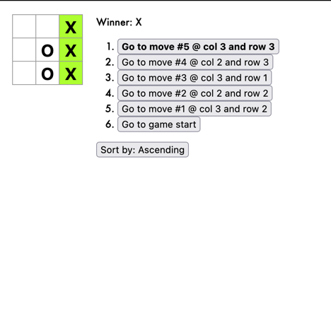
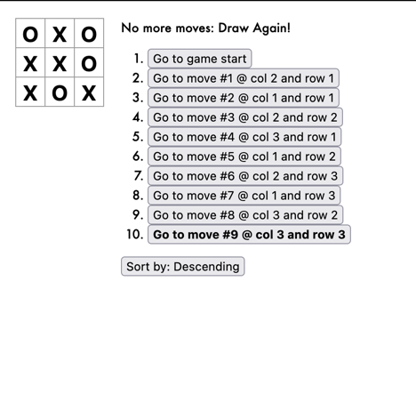

#  tic-tac-toe game app
## Simple interactive React application for tic-tac-toe game

Lets you play tic-tac-toe,
Indicates when a player has won the game,
Stores a game’s history as a game progresses,
Allows players to review a game’s history and see previous versions of a game’s board.

### Install the dependencies of the app
`npm install`

### Start the app
`npm start`

## Immutability
1. Immutability makes complex features much easier to implement.
Avoiding direct data mutation lets us keep previous versions of the game’s history intact, and reuse them later.
2. Detecting changes in mutable objects is difficult because they are modified directly. 
3. It helps you build pure components in React

## Application Preview

## If no more moves:

